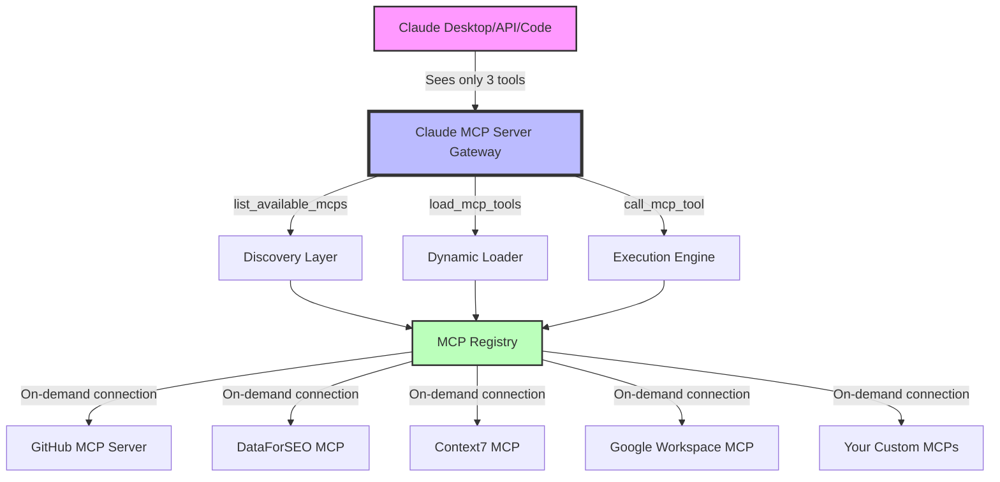

# Claude MCP Server Gateway

**The intelligent gateway for Claude Desktop MCP servers - reduce token usage by 95%**

[](https://opensource.org/licenses/MIT)
[](https://www.python.org/downloads/)
[](https://modelcontextprotocol.io)
[](https://claude.ai/download)

Claude MCP Server Gateway is a Python-based dynamic gateway that intelligently manages Model Context Protocol (MCP) servers for Claude Desktop, Claude API, and Claude Code. Instead of loading 100+ tools at startup (consuming 5,000-10,000 tokens), this gateway exposes only 3 essential tools initially, loading specific MCP servers on-demand.

[🚀 Quick Start](#quick-start) • [📦 Installation](#installation) • [🔧 Configuration](#configuration) • [📚 Documentation](#documentation) • [🤝 Contributing](#contributing)

## What is Claude MCP Server Gateway?

Claude MCP Server Gateway acts as an intelligent routing layer between Claude and your MCP servers. When you have multiple MCP servers configured (GitHub, Google Workspace, DataForSEO, Context7, etc.), Claude normally loads ALL their tools immediately. This gateway revolutionizes that approach:

**Traditional Approach**: Claude → 100+ tools loaded → Context window saturated  
**Gateway Approach**: Claude → 3 gateway tools → Load MCP servers as needed

This server gateway pattern is similar to API gateways but designed specifically for the Model Context Protocol ecosystem.

## Why Choose Claude MCP Server Gateway?

### The Problem with Multiple MCP Servers
When using Claude Desktop with multiple MCP servers, you face:
- **Token Explosion**: Each MCP server adds 10-50 tools to Claude's context
- **Context Saturation**: 5,000-10,000 tokens consumed before you even start
- **Tool Overload**: Claude sees 100+ tools, making selection slower and less accurate
- **Management Complexity**: No central control over MCP server lifecycle

### The Gateway Solution
Claude MCP Server Gateway solves these issues by acting as a master MCP server:
- **95% Token Reduction**: From ~10,000 tokens → ~300 tokens at startup
- **Dynamic Loading**: MCP servers load only when their tools are needed
- **Intelligent Management**: Automatic connection lifecycle and error handling
- **Universal Compatibility**: Works with any MCP server (Python, Node.js, TypeScript)

## How the Gateway Architecture Works



### Traditional vs Gateway Approach:

| Aspect | Traditional MCP Setup | Claude MCP Server Gateway |
|--------|----------------------|---------------------------|
| Initial Tools | 100-150 tools | 3 gateway tools |
| Token Usage | 5,000-10,000 | 200-300 |
| Context Available | 10-20% | 95-97% |
| Tool Discovery | All tools visible | Browse & load as needed |
| Connection Management | Always connected | Dynamic lifecycle |
| Error Isolation | Affects all tools | Per-server isolation |

## Quick Start

### For Claude Desktop Users

```bash
# 1. Clone the Claude MCP Server Gateway
git clone https://github.com/bzsasson/claude-mcp-server-gateway.git
cd claude-mcp-server-gateway

# 2. Set up Python environment
python3.11 -m venv .venv
source .venv/bin/activate  # On Windows: .venv\Scripts\activate

# 3. Install the gateway
pip install mcp python-dotenv

# 4. Configure your MCP servers
cp .env.example .env
# Edit .env with your API keys

# 5. Add to Claude Desktop (see detailed instructions below)
```

### For Claude API/Code Users
The gateway also works with Claude API and Claude Code - see [Advanced Usage](#advanced-usage).

## Installation

### Prerequisites
- Python 3.11+ (required for MCP server compatibility)
- Claude Desktop, Claude API access, or Claude Code
- MCP servers you want to use (GitHub, DataForSEO, etc.)

### Step 1: Install Claude MCP Server Gateway

```bash
# Clone the gateway repository
git clone https://github.com/bzsasson/claude-mcp-server-gateway.git
cd claude-mcp-server-gateway

# Create virtual environment (recommended for Python MCP servers)
python3.11 -m venv .venv
source .venv/bin/activate  # On Windows: .venv\Scripts\activate

# Install gateway dependencies
pip install -r requirements.txt
```

### Step 2: Configure Your MCP Servers

The gateway needs access to your MCP server credentials:

```bash
# Copy the example configuration
cp .env.example .env

# Edit with your MCP server API keys
nano .env  # or use your preferred editor
```

Add your API keys for the MCP servers you want to use through the gateway:

```env
# GitHub MCP Server
GITHUB_PERSONAL_ACCESS_TOKEN=your_github_token

# DataForSEO MCP Server
DATAFORSEO_USERNAME=your_username
DATAFORSEO_PASSWORD=your_password

# Add any other MCP server credentials
```

### Step 3: Configure Claude Desktop

Add Claude MCP Server Gateway to your Claude Desktop configuration:

**MacOS**: `~/Library/Application Support/Claude/claude_desktop_config.json`  
**Windows**: `%APPDATA%\Claude\claude_desktop_config.json`  
**Linux**: `~/.config/Claude/claude_desktop_config.json`

Replace your entire `mcpServers` section with just the gateway:

```json
{
  "mcpServers": {
    "claude-mcp-server-gateway": {
      "command": "/path/to/your/.venv/bin/python",
      "args": ["/path/to/claude-mcp-server-gateway/gateway.py"],
      "env": {}
    }
  }
}
```

**Important**: Update paths to match your actual installation location.

### Step 4: Restart Claude Desktop

Completely quit and restart Claude Desktop for the gateway to initialize.

## Using the Claude MCP Server Gateway

### Discovering Available MCP Servers

Ask Claude:
> "What MCP servers are available through the gateway?"

Claude will use the gateway to list all configured MCP servers with descriptions.

### Loading MCP Server Tools

> "Load the GitHub MCP server tools"

The gateway dynamically connects to GitHub's MCP server and exposes its tools.

### Using MCP Tools Through the Gateway

Once loaded, use tools naturally:
> "Search GitHub for repositories about Model Context Protocol"

The gateway manages the connection, execution, and cleanup automatically.

### Advanced Gateway Commands

```python
# List all available MCP servers
list_available_mcps()

# Load specific MCP server tools
load_mcp_tools(mcp_name="github")

# Execute any loaded MCP tool
call_mcp_tool(mcp_name="github", tool_name="search_repositories", arguments={...})
```

## Configuration

### Adding New MCP Servers to the Gateway

Extend the gateway with any MCP server by adding to `gateway.py`:

```python
MCP_SERVERS = {
    "your-mcp-server": {
        "command": "npx",  # or python path
        "args": ["-y", "your-mcp-package"],
        "env": {
            "API_KEY": os.getenv("YOUR_API_KEY", "")
        },
        "description": "Your MCP server description"
    }
}
```

The gateway automatically manages connections to both pre-configured and custom MCP servers.

### Timeout Configuration

Customize timeouts via environment variables:

```env
# Operation timeout (default: 300 seconds)
GATEWAY_OPERATION_TIMEOUT=300

# Initialization timeout (default: 30 seconds)
GATEWAY_INIT_TIMEOUT=30
```

## Pre-configured MCP Servers

Claude MCP Server Gateway comes with popular MCP servers pre-configured and ready to use:

### Developer Tools
- **GitHub** - Complete GitHub integration: repositories, issues, PRs, workflows
- **Context7** - Current code documentation and best practices lookup

### SEO & Analytics 
- **DataForSEO** - SERP data, keyword research, backlink analysis
- **Google Analytics** - Analytics reporting and metrics
- **Google Search Console** - Search performance and indexing

### Productivity & Collaboration
- **Google Workspace** - Gmail, Drive, Calendar, Docs, Sheets integration
- **Memory Extension Pro** - Persistent memory with semantic search

### Automation
- **Apify Actors** - Web scraping and automation workflows

## Performance & Benchmarks

### Token Usage Comparison

| Configuration | Tools Loaded | Initial Tokens | Context Available |
|--------------|-------------|---------------|-------------------|
| **Without Gateway** | | | |
| 5 MCP Servers | 105 tools | ~8,000 tokens | 20% |
| 10 MCP Servers | 215 tools | ~15,000 tokens | 6% |
| **With Claude MCP Server Gateway** | | | |
| Any number | 3 gateway tools | ~300 tokens | 97% |

### Real-World Example

A typical Claude Desktop setup with popular MCP servers:
- GitHub MCP: 25 tools × 150 tokens = 3,750 tokens
- DataForSEO MCP: 30 tools × 150 tokens = 4,500 tokens
- Google Workspace: 35 tools × 150 tokens = 5,250 tokens
- **Total without gateway**: 13,500 tokens (85% of context!)

**With Claude MCP Server Gateway**: 300 tokens (2% of context)

## Troubleshooting Claude MCP Server Gateway

### Gateway Not Appearing in Claude Desktop

**Solution**: 
1. Verify the gateway path in `claude_desktop_config.json`
2. Check Python path points to virtual environment
3. Restart Claude Desktop completely (not just close window)

### MCP Server Connection Errors Through Gateway

**Common causes**:
- Missing API credentials in `.env` file
- MCP server package not installed
- Network connectivity issues

**Solution**: Check gateway logs at `~/.claude-mcp-gateway/logs/`

### Claude Still Shows 100+ Tools Instead of Gateway

This means the gateway isn't being used. Ensure:
1. You've replaced ALL MCP server entries with just the gateway
2. Started a NEW conversation (gateway doesn't affect existing chats)
3. Claude Desktop was fully restarted after configuration

### Timeout Errors When Loading MCP Servers

Increase timeouts in your `.env`:
```env
GATEWAY_OPERATION_TIMEOUT=600
GATEWAY_INIT_TIMEOUT=60
```

## Technical Architecture

### Gateway Design Pattern

Claude MCP Server Gateway implements a lightweight service mesh pattern for MCP servers:

1. **Service Discovery**: Dynamic MCP server registration and discovery
2. **Load Balancing**: Intelligent routing to appropriate MCP servers  
3. **Circuit Breaking**: Automatic failure handling and recovery
4. **Connection Pooling**: Efficient resource management

### MCP Protocol Compliance

The gateway fully implements the Model Context Protocol specification (v2025-06-18):
- Standard MCP handshake and capability negotiation
- Tool discovery and invocation protocol
- Error handling and timeout management
- Compatible with all MCP transport types (stdio, HTTP+SSE)

### Supported MCP Server Types

- **Python MCP Servers**: Native support via subprocess
- **Node.js MCP Servers**: Full compatibility via npx
- **TypeScript MCP Servers**: Compiled or ts-node execution
- **Docker MCP Servers**: Container-based MCP servers
- **Remote MCP Servers**: HTTP+SSE based servers

### Performance Optimizations

- Lazy loading of MCP server connections
- Automatic connection cleanup after operations
- Shared environment variable management
- Intelligent caching of MCP server metadata

## Contributing

Contributions are welcome! Please see [CONTRIBUTING.md](CONTRIBUTING.md) for guidelines.

### Development Setup

```bash
# Clone the repository
git clone https://github.com/bzsasson/claude-mcp-server-gateway.git
cd claude-mcp-server-gateway

# Create virtual environment
python3.11 -m venv .venv
source .venv/bin/activate

# Install dependencies
pip install -r requirements.txt
pip install -r requirements-dev.txt

# Run tests
python -m pytest tests/
```

## Related Resources

### Official Documentation
- [Model Context Protocol Specification](https://modelcontextprotocol.io) - Official MCP docs
- [Claude Desktop Download](https://claude.ai/download) - Get Claude Desktop
- [Anthropic MCP Guide](https://docs.anthropic.com/mcp) - Anthropic's MCP documentation

### Community Resources
- [Awesome MCP Servers](https://github.com/topics/mcp-server) - Discover MCP servers
- [MCP Server Development Guide](https://modelcontextprotocol.io/docs/server) - Build your own

### Gateway Ecosystem
- [Claude MCP Server Gateway Wiki](https://github.com/bzsasson/claude-mcp-server-gateway/wiki) - Extended documentation
- [Gateway Configuration Examples](https://github.com/bzsasson/claude-mcp-server-gateway/tree/main/examples) - Sample configs

## License

MIT License - see [LICENSE](LICENSE) file for details.

## Acknowledgments

- Built on the [Model Context Protocol](https://modelcontextprotocol.io) specification
- Uses patterns from the official MCP Python SDK
- Inspired by Context7 documentation and best practices

## Keywords

Python MCP server gateway, Claude MCP Server Gateway, Model Context Protocol gateway, Claude Desktop MCP integration, MCP server manager, token optimization for Claude, dynamic MCP loading, Claude AI gateway, Anthropic MCP tools, context window management, MCP server Python, claude-mcp-server, server gateway architecture

---

**Built with** [Model Context Protocol](https://modelcontextprotocol.io) | **For** [Claude Desktop](https://claude.ai) | **License**: MIT